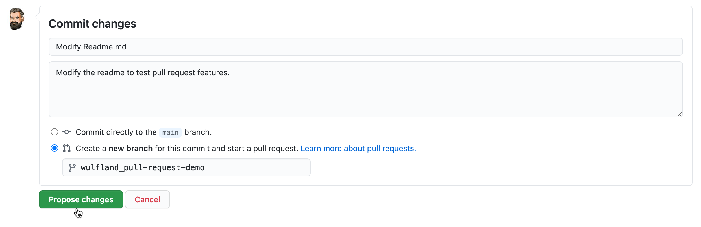
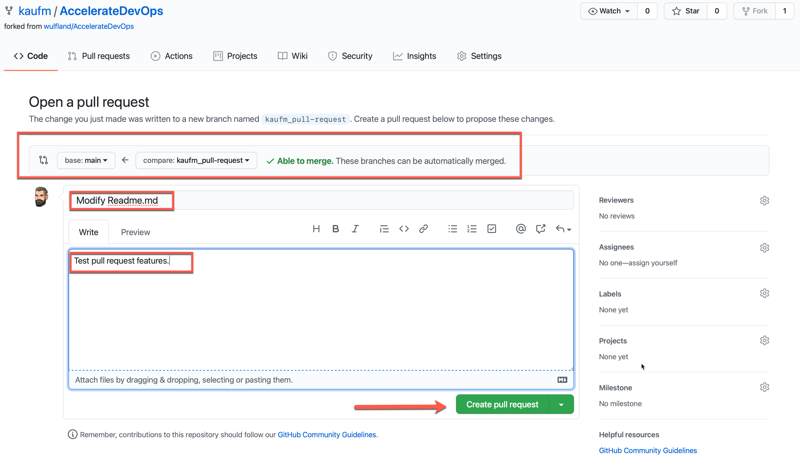
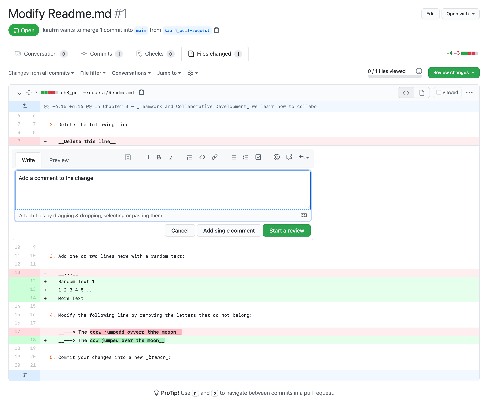
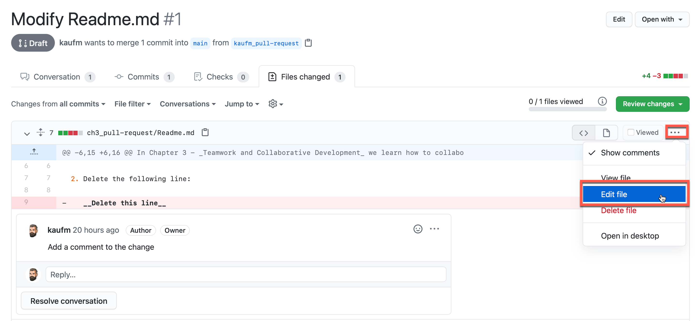
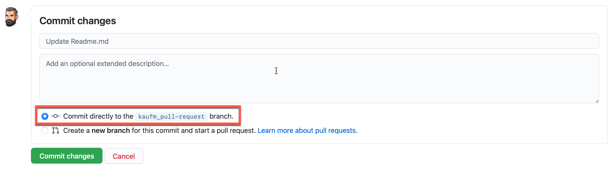
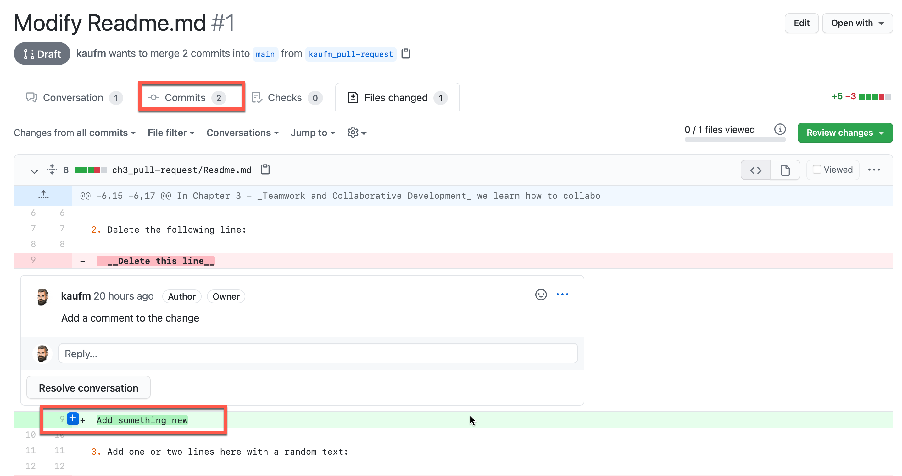

# Creating a pull request

In Chapter 3 - _Teamwork and Collaborative Development_ we learn how to collaborate using pull-requests. Use this file to review your first changes.

1. To get started create a fork of this repository by clicking `Fork` in the top right corner. This creates a copy of the repository in your profile. Then navigate again to this file and lick the edit icon :pen: above the file content.

2. Delete the following line:

   __Delete this line__

3. Add one or two lines here with a random text:

   __...__

4. Modify the following line by removing the letters that do not belong:

   __---> The ccow jumpedd ovverr thhe mooon__

5. Commit your changes into a new _branch_:

   

6. In the next screen create the pull request by completing the title and description. Note the complete markdown support that we've seen in Chapter 2 for issues:

   

   Make sure that the pull request uses base:main and not the upstream repository. This should be correct by default.

7. Got to `Files changed` and note the changes (deleted lines red, added lines green). Add a comment to a line by clicking the `+`at the beginning of the line when hovering with the mouse over it. Add a comment to line nine and click `Add single comment`.

   

8. Edit the file opening the menu in the top right corner and selecting `Edit file`.

   

   Add a new line of text to line 9 and commit directly to the branch you created earlier.

   

   Navigate back to the pull request and note that you can review the file with all changes (`Files changed`) or individual `Commits`. You can comment in both views.

   
