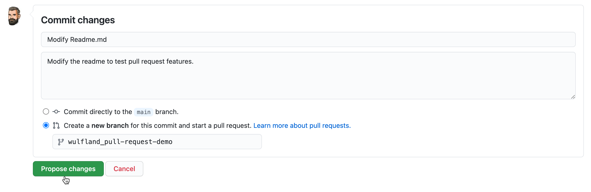
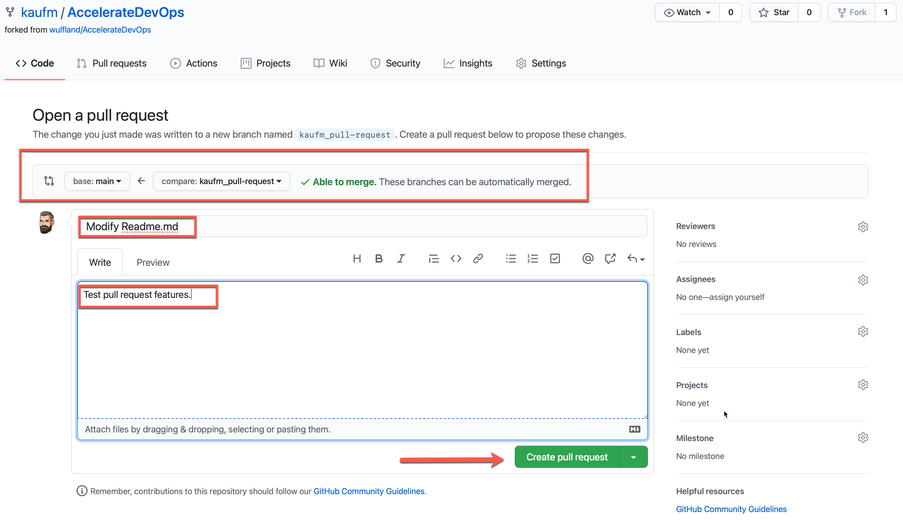
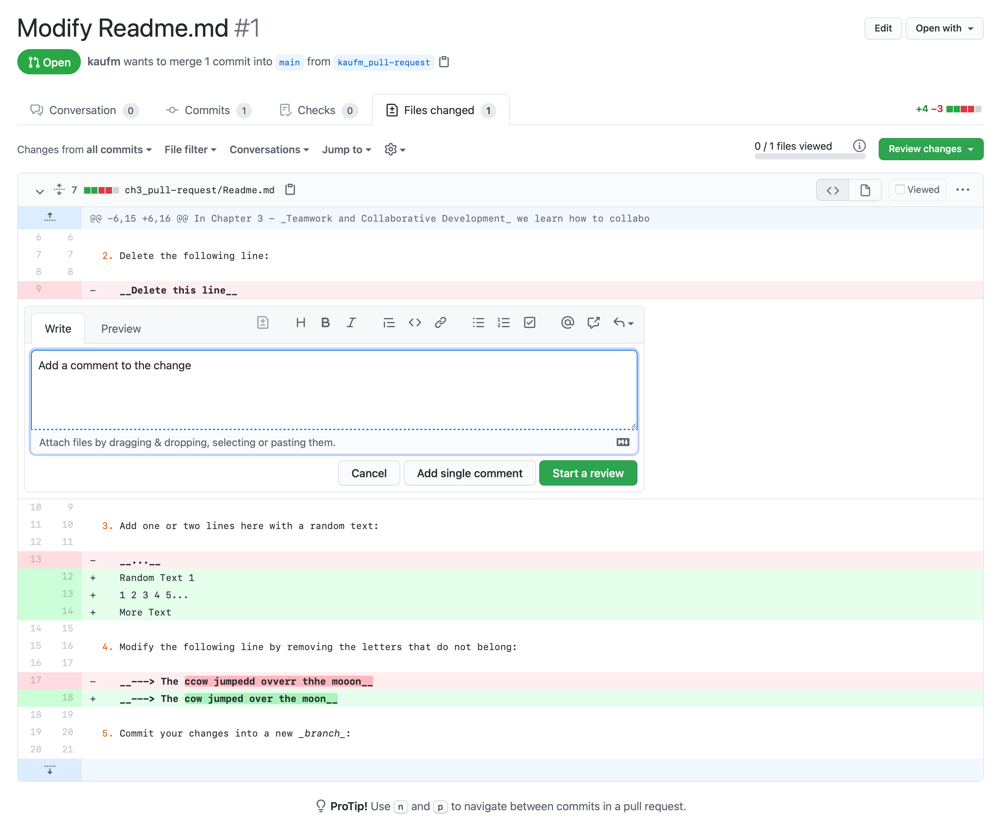
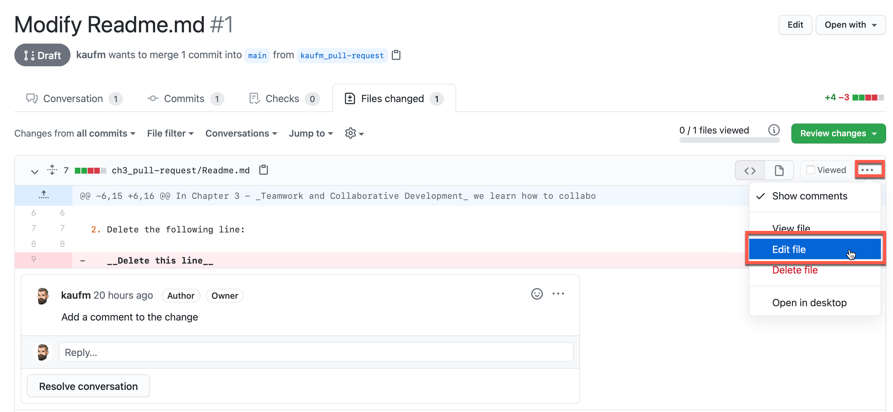
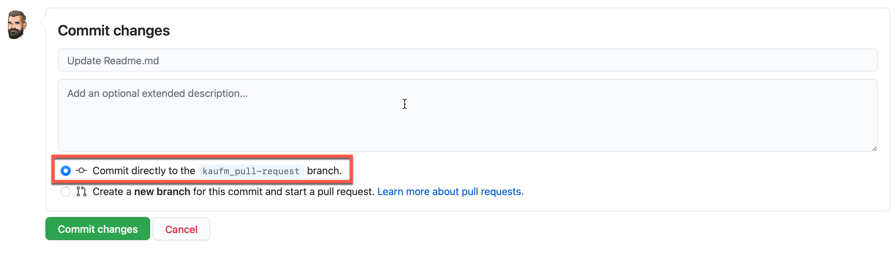
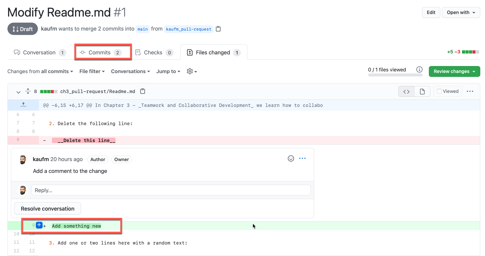

# Creating a pull request

In Chapter 3 - _Teamwork and Collaborative Development_ we learn how to collaborate using pull-requests. Use this file to review your first changes.

1. To get started create a fork of this repository by clicking `Fork` in the top right corner. This creates a copy of the repository in your profile. Then navigate again to this file and lick the edit icon :pen: above the file content.

2. Delete the following line:

It was a simple tip of the hat. Grace didn't think that anyone else besides her had even noticed it. It wasn't anything that the average person would notice, let alone remember at the end of the day. That's why it seemed so unbelievable that this little gesture would ultimately change the course of the world.

3. Add one or two lines here with a random text:

   __...__

4. Modify the following line by removing the letters that do not belong:

   __---> The cow jumped over the moon__

5. Commit your changes into a new _branch_:

   

6. In the next screen create the pull request by completing the title and description. Note the complete markdown support that we've seen in Chapter 2 for issues:

   

   Make sure that the pull request uses base:main and not the upstream repository. This should be correct by default.

7. Got to `Files changed` and note the changes (deleted lines red, added lines green). Add a comment to a line by clicking the `+`at the beginning of the line when hovering with the mouse over it. Add a comment to line nine and click `Add single comment`.

   

8. Edit the file opening the menu in the top right corner and selecting `Edit file`.

   

   Add a new line of text to line 9 and commit directly to the branch you created earlier.

   

   Navigate back to the pull request and note that you can review the file with all changes (`Files changed`) or individual `Commits`. You can comment in both views.

   

The shoes had been there for as long as anyone could remember. In fact, it was difficult for anyone to come up with a date they had first appeared. It had seemed they'd always been there and yet they seemed so out of place. Why nobody had removed them was a question that had been asked time and again, but while they all thought it, nobody had ever found the energy to actually do it. So, the shoes remained on the steps, out of place in one sense, but perfectly normal in another.
