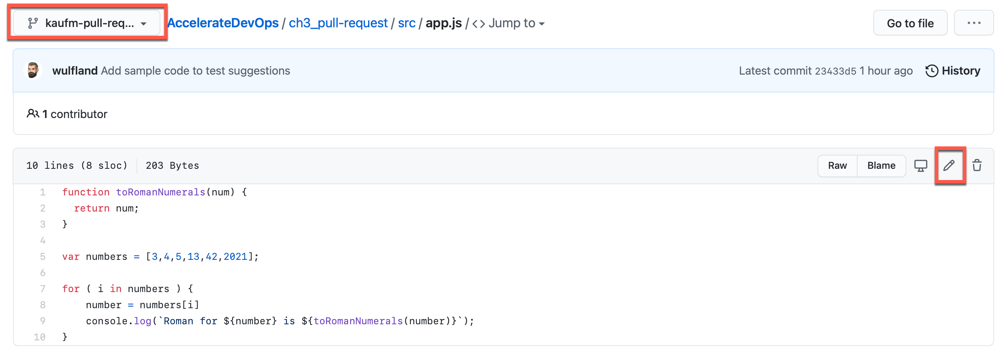
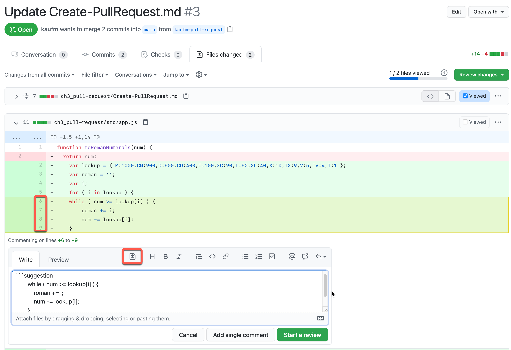

# Review changes

This is the hands-on part in chapter 3 for reviewing changes - especially making suggestions.

## Making suggesations

1. Copy the following code to your clipboard by clicking the icon in the top right corner.

    ```javascript
        var lookup = { M:1000,CM:900,D:500,CD:400,C:100,XC:90,L:50,XL:40,X:10,IX:9,V:5,IV:4,I:1 };
        var roman = '';
        var i;
        for ( i in lookup ) {
        while ( num >= lookup[i] ) {
            roman += i;
            num -= lookup[i];
        }
        }
        return roman;
    ```

2. Navigate to [src/app.js](src/app.js) and edit the file by clicking the pencil :pen: icon in the top right corner. Make sure you have selected the right branch in the top left corner!

    

3. Delete line 2 and insert the code by presssing <kbd>Ctrl</kbd>+<kbd>V</kbd>.

4. Commit directly to the branch you created in [Create-PullRequest.md](Create-PullRequest.md)

5. Navigate back to the pull request and look for src/app.js under `Files changed`. Mark lines 6 to 9 and create a multi-line comment. Click the suggestion button and you'll see that the code is in the suggestion block including whitespaces.

    

6. Add 4 blanks to the beginning of every line to fix the indent issue with the nested while loop. Click `Add single comment`.

## Incorporating feedback in your pull request

7. You can commit the suggestion directly to your branch, or you can batch multiple suggestions to one commit and the commit all the changes at once.

    
