You can use markdown to write and format text in GitHub - in Issues, Pull Requests, and markdown files. Here is a list of the most important features.

### Headings 

# `#` Heading
## `##` Heading2
### `###` Heading3

### Formatting text

Formatting `**`**bold text**`**`, `_`_italic text_`_` and `***`***bold and italic***`***`. 
You can also use `~~`~~strikethrough text~~`~~`. 

> `>` This is a quote
>> `>>` This is a nested quote

## Links

https://xpirit.com/
[Link Text](https://xpirit.com)
[Test.pdf](https://github.com/wulfland/AccelerateDevOps/files/8073527/Test.pdf)

### Images

You can drag or drop images to markdown and they will get uploaded automatically.


#### Size images

Use `img` to set the with of the image:


#### Display images depending on theme:


You can now also use `picture` tag:

<picture>
  <source media="(prefers-color-scheme: dark)" srcset="https://user-images.githubusercontent.com/5276337/170288514-21321111-72b7-4ec2-98e6-b19c9a090721.png">
  
</picture>

### Videos

https://user-images.githubusercontent.com/5276337/154125940-0172902e-da3f-4e6e-a4a4-cab7c6a86cde.mp4

### Lists

- List item 1
- List item 2

1. Item 1
2. Item 2 

###  Nested lists
1. Root
    - First nested item
       - Second nested item


### Footnotes

You can user a footnote[^1] in markdown that allows you to jump to it and back using links.

A footnote can have multiple lines[^2].  

You can also use words, to fit your writing style more closely[^note].

[^1]: My reference.
[^2]: Every new line should be prefixed with 2 spaces.  
  This allows you to have a footnote with multiple lines.
[^note]:
    Named footnotes will still render with numbers instead of the text but allow easier identification and linking.  
    This footnote also has been made with a different syntax using 4 spaces for new lines.
    
### Comments and escaping

<!-- This comment will not appear in the rendered Markdown -->

Use <kbd>\\</kbd> to escape markdown: This text is \*not bold\* and \_not italic\_.

### emojis and keyboard keys

:+1: :shipit: :medal_sports: :-1: :100: :trophy: :house:

<kbd>Ctrl</kbd> <kbd>Enter</kbd> <kbd>Space</kbd> <kbd>Ctrl</kbd>+<kbd>C</kbd>


### Tables

| Left-aligned | Center-aligned | Right-aligned |
| :---               |            :---:         |               ---: |
| **title1**      | `git status`        | 1.75%  |
| **title2**     | `git diff`             | 2.81%  |
| **title3**     | `git add`            | 3.51%  |

### Collapsable sections

<details>
This content is hidden by default and you have to click `Details` to see it.
</details>

<details>
  <summary>Details with custom summary</summary>
  This content is hidden by default and you have to click `Details with custom summary` to see it.
</details>

### Syntax highlighted code blocks

C#:
```csharp
void WriteHelloWorld(string name)
{
  Console.WriteLine("Hello World and {0}!", name);
}
WriteHelloWorld("John Doe");
// writes 'Hello World and Johnm Doe' to STDOUT
```
Ruby:
```ruby
def print_helloWorld(name)
  puts "Hello World and #{name}!"
end
print_helloWorld('Jon Doe')
#=> prints 'Hello World and Jon Doe!' to STDOUT.
```
JavaScript:
```javascript
function writeHelloWorld(name) {
  console.log(`Hello World and ${name}!`);
}
writeHelloWorld('Jon Doe');
// writes 'Hello World and Jon Doe!' to STDOUT.
```

### Flow Chart


### Sequence diagram

```mermaid
sequenceDiagram
    participant Me
    participant You
    Me->>You: Hello, how are you?
    loop Self reflection
        You->>You: How am I?
    end
    Note right of You: Say the truth? 🤔 
    You-->>Me: Great!
```



### Gant Diagram


### Class diagram


### Mentions

Mention using GitHub handle: @kaufm (only works in Issues and Pull Requests)

### Reference labels

Reference labels in markdown: https://github.com/wulfland/AccelerateDevOps/labels/documentation


### Geo location

```geojson
{
  "type": "Feature",
  "geometry": {
    "type": "Point",
    "coordinates": [-4.842228, 36.502749]
  },
  "properties": {
    "name": "Kitesurf Zone",
    "Conditions": "Poniente, Levante",
    "Ratings": "⭐ ⭐ ⭐ ⭐ ⭐ "
  }
}
```

### topoJSON

```topojson
{
    "type": "Topology",
    "objects": {
        "data": {
            "geometries": [
                {
                    "id": "0",
                    "type": "Polygon",
                    "properties": {"name": "abc"},
                    "bbox": [0.0, 0.0, 1.0, 1.0],
                    "arcs": [[-2, 0]]
                },
                {
                    "id": "1",
                    "type": "Polygon",
                    "properties": {"name": "def"},
                    "bbox": [1.0, 0.0, 2.0, 1.0],
                    "arcs": [[1, 2]]
                }
            ],
            "type": "GeometryCollection"
        }
    },
    "bbox": [0.0, 0.0, 2.0, 1.0],
    "arcs": [
        [[1.0, 0.0], [0.0, 0.0], [0.0, 1.0], [1.0, 1.0]], [[1.0, 0.0], [1.0, 1.0]],
        [[1.0, 1.0], [2.0, 1.0], [2.0, 0.0], [1.0, 0.0]]
    ]
}
```


### STL 3D rendering

```stl
solid b'STLB ATF 10.13.0.1454 COLOR=&\x83\xe7\xff'
facet normal -0.000000 0.000000 34.810009
  outer loop
    vertex 50.000000 5.900000 5.900000
    vertex 50.000000 0.000000 5.900000
    vertex 55.900002 5.900000 5.900000
  endloop
endfacet
facet normal 0.000000 0.000000 34.810009
  outer loop
    vertex 55.900002 5.900000 5.900000
    vertex 50.000000 0.000000 5.900000
    vertex 55.900002 0.000000 5.900000
  endloop
endfacet
facet normal -0.000000 -0.000000 -34.810009
  outer loop
    vertex 55.900002 5.900000 0.000000
    vertex 55.900002 0.000000 0.000000
    vertex 50.000000 5.900000 0.000000
  endloop
endfacet
facet normal 0.000000 0.000000 -34.810009
  outer loop
    vertex 50.000000 5.900000 0.000000
    vertex 55.900002 0.000000 0.000000
    vertex 50.000000 0.000000 0.000000
  endloop
endfacet
facet normal 34.810001 -0.000000 0.000000
  outer loop
    vertex 55.900002 0.000000 5.900000
    vertex 55.900002 0.000000 0.000000
    vertex 55.900002 5.900000 5.900000
  endloop
endfacet
facet normal 34.810001 0.000000 0.000000
  outer loop
    vertex 55.900002 5.900000 5.900000
    vertex 55.900002 0.000000 0.000000
    vertex 55.900002 5.900000 0.000000
  endloop
endfacet
facet normal 0.000000 -34.810009 0.000000
  outer loop
    vertex 50.000000 0.000000 5.900000
    vertex 50.000000 0.000000 0.000000
    vertex 55.900002 0.000000 5.900000
  endloop
endfacet
facet normal 0.000000 -34.810009 -0.000000
  outer loop
    vertex 55.900002 0.000000 5.900000
    vertex 50.000000 0.000000 0.000000
    vertex 55.900002 0.000000 0.000000
  endloop
endfacet
facet normal -34.810001 -0.000000 -0.000000
  outer loop
    vertex 50.000000 5.900000 5.900000
    vertex 50.000000 5.900000 0.000000
    vertex 50.000000 0.000000 5.900000
  endloop
endfacet
facet normal -34.810001 0.000000 0.000000
  outer loop
    vertex 50.000000 0.000000 5.900000
    vertex 50.000000 5.900000 0.000000
    vertex 50.000000 0.000000 0.000000
  endloop
endfacet
facet normal 0.000000 34.810009 0.000000
  outer loop
    vertex 55.900002 5.900000 5.900000
    vertex 55.900002 5.900000 0.000000
    vertex 50.000000 5.900000 5.900000
  endloop
endfacet
facet normal 0.000000 34.810009 0.000000
  outer loop
    vertex 50.000000 5.900000 5.900000
    vertex 55.900002 5.900000 0.000000
    vertex 50.000000 5.900000 0.000000
  endloop
endfacet
endsolid b'STLB ATF 10.13.0.1454 COLOR=&\x83\xe7\xff'

```

### Past tables and spreadsheets to markdown:

<html xmlns:v="urn:schemas-microsoft-com:vml"
xmlns:o="urn:schemas-microsoft-com:office:office"
xmlns:x="urn:schemas-microsoft-com:office:excel"
xmlns="http://www.w3.org/TR/REC-html40">

<head>

<meta name=ProgId content=Excel.Sheet>
<meta name=Generator content="Microsoft Excel 15">
<link id=Main-File rel=Main-File
href="file:////Users/mike/Library/Group%20Containers/UBF8T346G9.Office/TemporaryItems/msohtmlclip/clip.htm">
<link rel=File-List
href="file:////Users/mike/Library/Group%20Containers/UBF8T346G9.Office/TemporaryItems/msohtmlclip/clip_filelist.xml">
<style>
<!--table
	{mso-displayed-decimal-separator:"\,";
	mso-displayed-thousand-separator:"\.";}
@page
	{margin:.75in .7in .75in .7in;
	mso-header-margin:.3in;
	mso-footer-margin:.3in;}
tr
	{mso-height-source:auto;}
col
	{mso-width-source:auto;}
br
	{mso-data-placement:same-cell;}
td
	{padding-top:1px;
	padding-right:1px;
	padding-left:1px;
	mso-ignore:padding;
	color:black;
	font-size:12.0pt;
	font-weight:400;
	font-style:normal;
	text-decoration:none;
	font-family:Calibri, sans-serif;
	mso-font-charset:0;
	mso-number-format:General;
	text-align:general;
	vertical-align:bottom;
	border:none;
	mso-background-source:auto;
	mso-pattern:auto;
	mso-protection:locked visible;
	white-space:nowrap;
	mso-rotate:0;}
-->
</style>
</head>

<body link="#0563C1" vlink="#954F72">


Animal | Color | Amount
-- | -- | --
Tiger | Yellow | 25
Horse | Brown | 7


</body>

</html>

Disable using <kbd>cmd|ctrl</kbd>+<kbd>shift</kbd>+<kbd>v</kbd>:

Animal	Color	Amount
Tiger	Yellow	25
Horse	Brown	7

### Render mathematical expressions in Markdown using LaTeX syntax:

**The Cauchy-Schwarz Inequality**
$$\left( \sum_{k=1}^n a_k b_k \right)^2 \leq \left( \sum_{k=1}^n a_k^2 \right) \left( \sum_{k=1}^n b_k^2 \right)$$

Render it inline:
This sentence uses `$` delimiters to show math inline:  $\sqrt{3x-1}+(1+x)^2$


